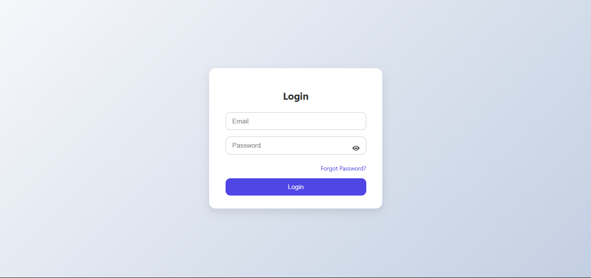
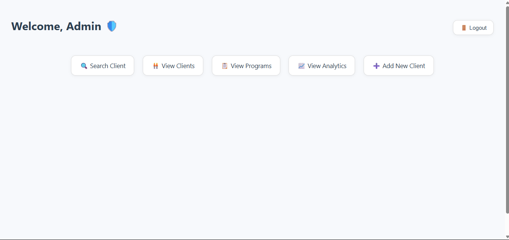
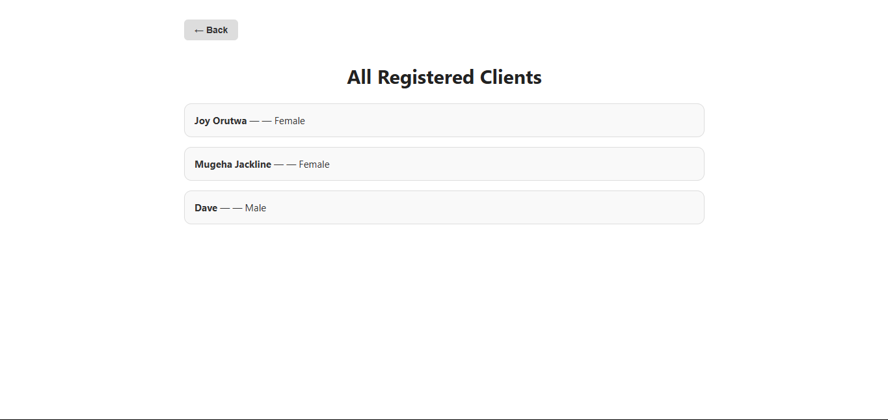
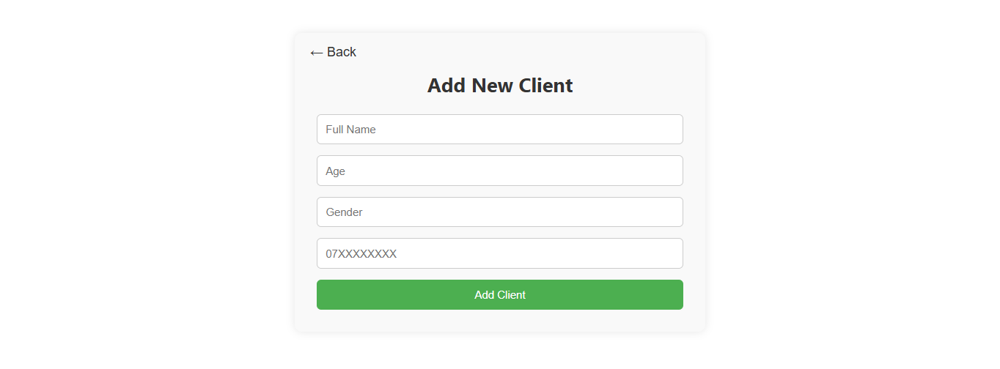
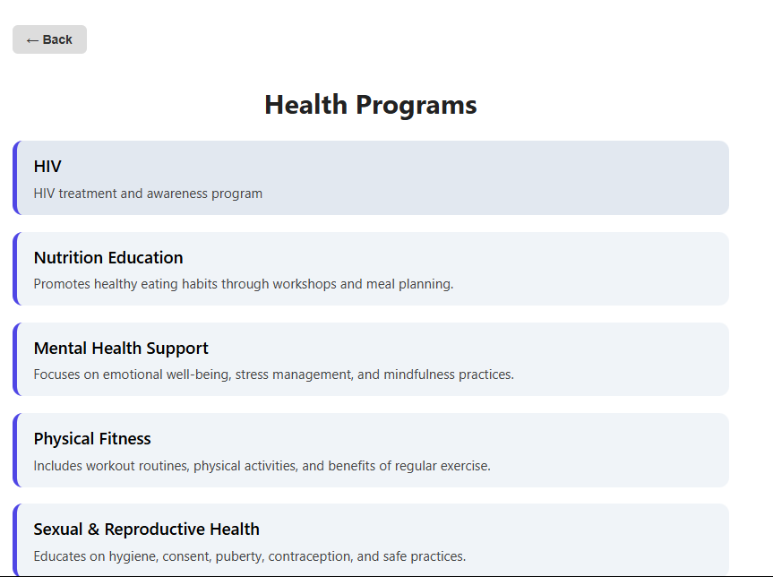

# 🏥 Health Info System

A full-stack Health Information Management System designed for doctors to manage clients and enroll them in programs like TB, Malaria, and HIV.

Link to powerpoint
[View Presentation](https://docs.google.com/presentation/d/1d0M4rmyCG8op7vEPvlCEHliWgL34ZRUhx_TfuKSaU3k/edit?usp=sharing)

---

## 🌐 Live Demo

👉 [**Live on Render**](https://your-render-url-here.com) ← _(Link will be updated after deployment)_

---

## ✨ Features

- 🔐 **Authentication**: Staff/Admin login with JWT
- 🩺 **Health Programs**: Create and manage health programs
- 📚 **Enroll clients**: Enroll clients into programs
- 🧍‍♂️ **Client Profiles**: View client profiles (with enrolled programs)
- 🔍 **Search Clients**: Public and internal search by name
- 📞 **Phone Format**: Supports both `07xxx` and `2547xxx` formats
- ⭐ **User Roles**: Dynamic dashboard greetings (Admin, Staff, Guest)
- 🌐 **Responsive Design**: Works well on all screen sizes

---

## 🚀 Tech Stack

| Layer       | Tech                  |
|-------------|-----------------------|
| Frontend    | React, CSS Modules    |
| Backend     | Node.js, Express.js   |
| Database    | MongoDB Atlas         |
| Deployment  | Render (Backend), Netlify or Vercel (Frontend) |
| Auth        | JWT                   |

---

## ⚙️ Environment Variables

### 📦 Backend `.env` (example)

```env
MONGO_URI=your_mongodb_uri
PORT=5000
JWT_SECRET=your_jwt_secret

```

### 💻 Frontend .env

```env
REACT_APP_API_BASE_URL=https://your-backend-url.onrender.com
```

## 📦 Setup Instructions

1. Clone the repo

```bash
git clone https://github.com/your-username/health-info-system.git
cd health-info-system
Install dependencies
```

2. Install dependencies

```bash
npm install
```

3. Create a .env file and add the following:

```bash
PORT=5000
MONGO_URI=your_mongodb_connection_string
JWT_SECRET=your_jwt_secret
```

4. Start the server

```bash
npm run dev
```

## 📦 Test the app locally

- Frontend: http://localhost:3000

- Backend API: http://localhost:5000/api/clients

## 🔐 Authentication Roles
Admin 🛡️

Staff 🧑‍⚕️

Guest 🙋

Each role sees a personalized dashboard greeting.

## 📸 Project Screenshots

  
  
  
  
  
  
  


## 👩‍⚕️ User Flow / Experience:

Login with doctor credentials

Dashboard: View client summary, access features

Add Client: Fill out form, auto-redirect to Clients list

View Clients: Scroll/search through registered patients

Enroll in Programs: Assign one or more programs to each client

## 🔮 Future Improvements

These are some extra features and enhancements planned for the next phase:

🧑‍⚕️ Doctor profile management with update/delete

🗓️ Appointment scheduling between clients and doctors

💬 Messaging/chat between doctor and client

📅 Program timelines and progress tracking

📊 Dashboard with analytics for program impact

🗒️ Client visit history and reports

🖥️ Fully responsive frontend using React.js

📂 Export data (PDF/CSV) for reporting

📲 Mobile-friendly version or mobile app support
