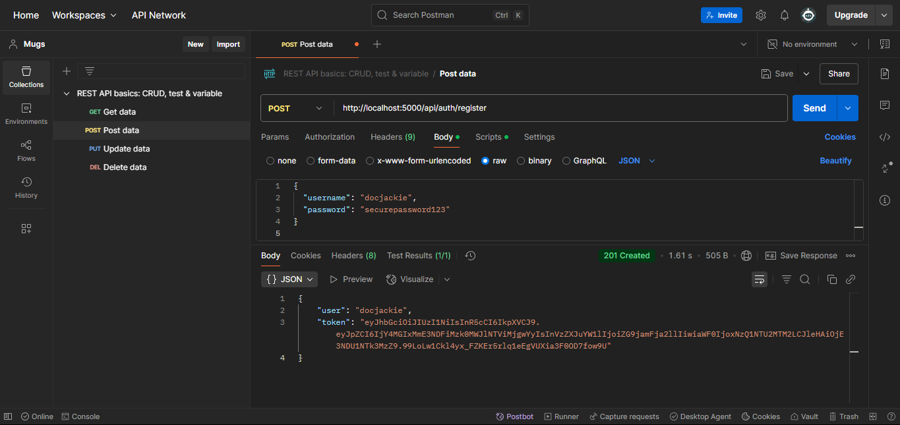
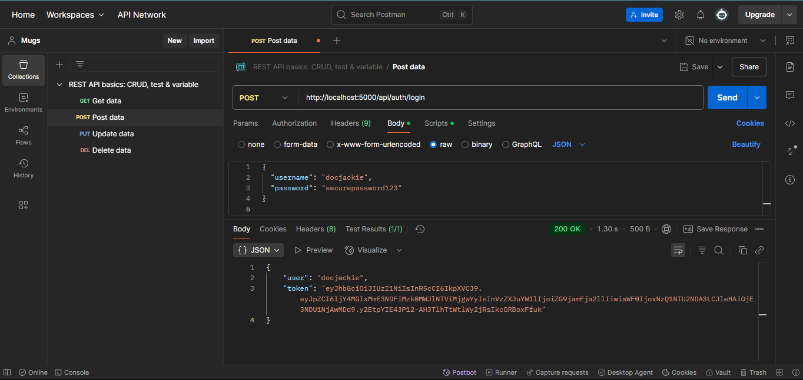
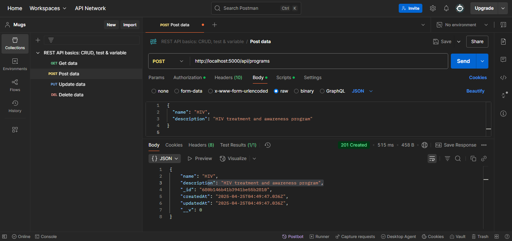
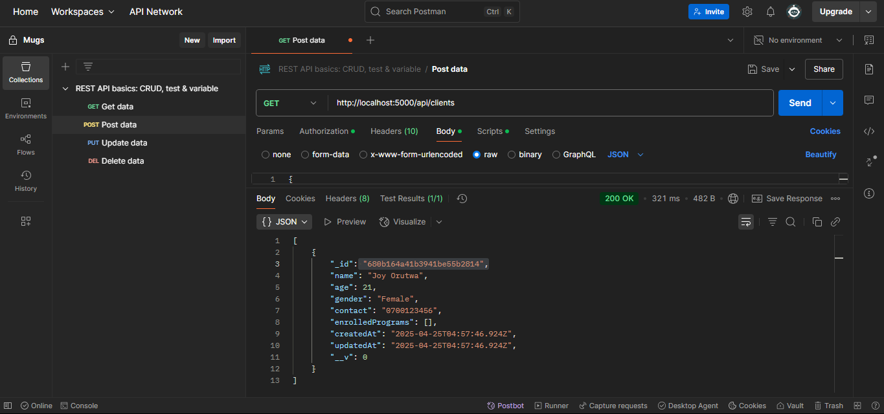
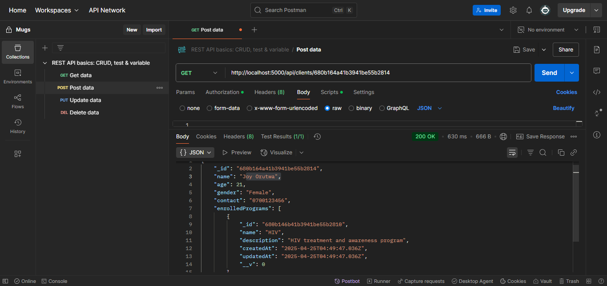
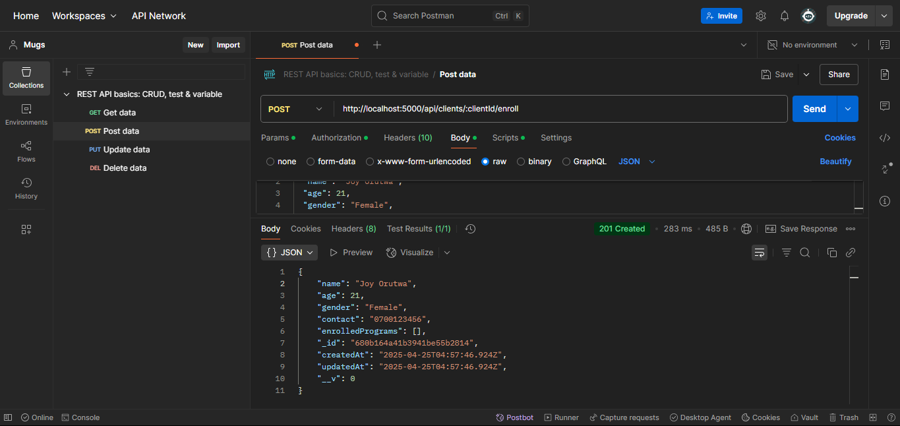
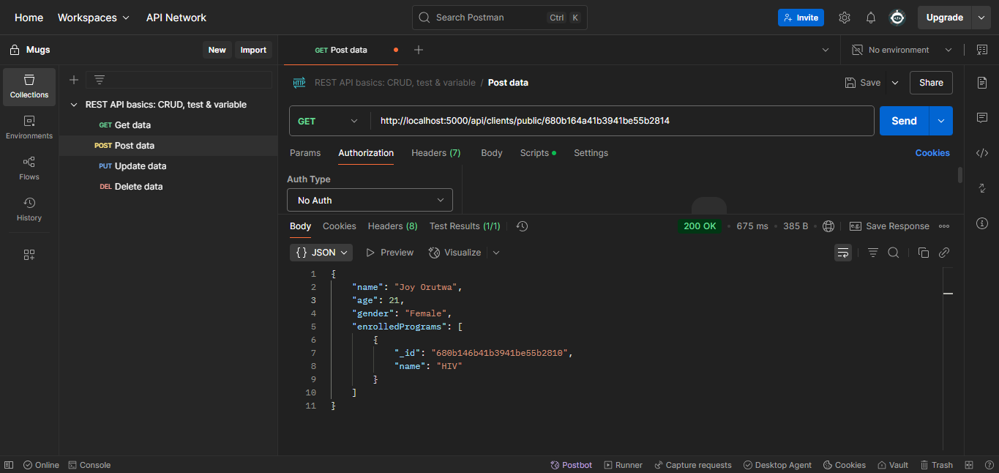

# 🏥 Health Info System

A full-stack Health Information Management System designed for doctors to manage clients and enroll them in programs like TB, Malaria, and HIV.

Link to powerpoint
[View Presentation](https://docs.google.com/presentation/d/1d0M4rmyCG8op7vEPvlCEHliWgL34ZRUhx_TfuKSaU3k/edit?usp=sharing)

---

## 🌐 Live Demo

👉 [**Live on Render**](https://your-render-url-here.com) ← _(Link will be updated after deployment)_

---

## ✨ Features

- 🔐 **Authentication**: Staff/Admin login with JWT
- 🩺 **Health Programs**: Create and manage health programs
- 📚 **Enroll clients**: Enroll clients into programs
- 🧍‍♂️ **Client Profiles**: View client profiles (with enrolled programs)
- 🔍 **Search Clients**: Public and internal search by name
- 📞 **Phone Format**: Supports both `07xxx` and `2547xxx` formats
- ⭐ **User Roles**: Dynamic dashboard greetings (Admin, Staff, Guest)
- 🌐 **Responsive Design**: Works well on all screen sizes

---

## 🚀 Tech Stack

| Layer       | Tech                  |
|-------------|-----------------------|
| Frontend    | React, CSS Modules    |
| Backend     | Node.js, Express.js   |
| Database    | MongoDB Atlas         |
| Deployment  | Render (Backend), Netlify or Vercel (Frontend) |
| Auth        | JWT                   |

---

## 📦 Setup Instructions

1. Clone the repo
- bash
- git clone https://github.com/your-username/health-info-system.git
- cd health-info-system
- Install dependencies

- npm install
- Create a .env file:

- env
- Copy
- Edit
- PORT=5000
- MONGO_URI=your_mongodb_connection_string
- JWT_SECRET=your_jwt_secret
- Run the server

- bash
- Copy
- Edit
- npm run dev
  
🔑 API Routes
🧑‍⚕️ Auth
POST /api/auth/signup – Register doctor

POST /api/auth/login – Login doctor

Test Register doctor with postman

Test Login doctor with postman

💊 Programs
POST /api/programs – Create program
Test Create Program with postman

GET /api/programs – Get all programs

🧍 Clients
POST /api/clients – Register client

GET /api/clients – Search/list clients
Test get clients api with postman

GET /api/clients/:id – View client profile
Test get client profile with postman

POST /api/clients/:id/enroll – Enroll client in programs
Test enroll client in a program with postman

🌐 Public
GET /api/public/client/:id – View public client profile (no auth)

🧪 Sample Request: Enroll a Client

- POST /api/clients/:id/enroll
- Authorization: Bearer <token>
- Content-Type: application/json

{
  "programIds": ["<programId1>", "<programId2>"]
}

## 👩‍⚕️ User Flow / Experience:
Login/Access:

The doctor logs in securely (JWT-based auth is assumed).

Lands on a personalized dashboard: "Welcome, Doctor 👨‍⚕️"

Dashboard Options:

📋 View Clients — Navigate to a list of all registered clients (pulled from backend).

➕ Add Client — Opens a form to register a new client.

🔍 Search Client (Public) — Search bar to find a client quickly (ideal for public directory or faster access).

Adding a Client:

Doctor clicks “Add Client”.

Fills out a form with name, age, gender, and contact info.

Hits "Submit" — data is sent to a Node.js/Express backend and saved in a MongoDB (or other DB).

After successful submission, doctor is auto-redirected to the Clients list.

Viewing Clients:

Clients page shows a table/list of clients fetched from the backend.

Easy to scroll through and see client details.

## 🔮 Future Improvements

These are some extra features and enhancements planned for the next phase:

🧑‍⚕️ Doctor profile management with update/delete

🗓️ Appointment scheduling between clients and doctors

💬 Messaging/chat between doctor and client

📅 Program timelines and progress tracking

📊 Dashboard with analytics for program impact

🗒️ Client visit history and reports

🔒 Role-based access control (admin, doctor, support staff)

🖥️ Fully responsive frontend using React.js

📂 Export data (PDF/CSV) for reporting

📲 Mobile-friendly version or mobile app support
